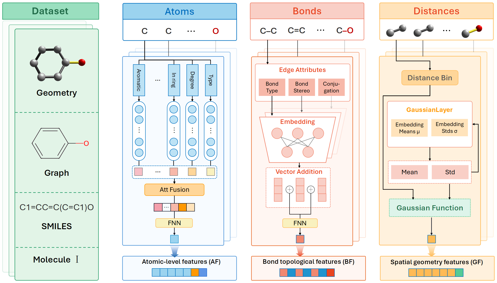

<h1 style="border-bottom: 2px solid lightgray;">TriPercept: A Unified Fine-Grained Structural Perception Model for Molecular Property Prediction</h1>

__Abstract:__ Accurate prediction of molecular properties is a fundamental component of Artificial Intelligence-driven Drug Design (AIDD). In molecular property prediction, even slight structural variations, such as atomic arrangement or bond length, could impact molecular properties. Existing methods primarily focus on coarse-grained molecular modeling on SMILES, 2D, or 3D graphs. However, this paradigm struggles to adequately capture complex internal molecular interactions and overlooks finer-grained structural details, such as atom-bond-spatial positions. In this paper, we propose a molecular property prediction model, TriPercept, based on unified fine-grained representation learning. Specifically, TriPercept integrates atomic, topological, and geometric features, fully exploiting their intrinsic complementarity. We introduce three dedicated encoders to separately learn features at the atomic, bond, and spatial distance levels, thus addressing the neglect of complex structural details. Additionally, we design a structure-aware graph neural network to integrate these features and enhance structural consistency modeling with a contrastive and self-supervised based pretraining strategy. To evaluate the performance of TriPercept, we conduct systematic experiments on six classification datasets and six regression datasets. The results demonstrate that TriPercept performs excellently on most datasets. Visualization experiments further verify that TriPercept not only confirms the effectiveness of multi-level structural integration but also clearly reveals its interpretability in focusing on chemically relevant features and capturing complex structural relationships.



## Getting Started

### Installation

Set up conda environment and clone the github repo

```
cd ./TriPercept-main
conda env create -f requirement.yaml
conda activate TriP
pip install torch==1.7.1+cu110 torchvision==0.8.2+cu110 torchaudio==0.7.2 -f https://download.pytorch.org/whl/torch_stable.html
pip install torch_geometric==1.6.3
pip install torch_scatter==2.0.7
pip install torch_sparse==0.6.9
pip install azureml-defaults
pip install rdkit-pypi cython
python setup.py build_ext --inplace
python setup_cython.py build_ext --inplace
pip install -e .
pip install --upgrade protobuf==3.20.1
pip install --upgrade tensorboard==2.9.1
pip install --upgrade tensorboardX==2.5.1
```
###Pre-training

To train the TriPercept, where the configurations and detailed explaination for each variable can be found in config.yaml

```
$ python TriP.py
```

### Training

To finetune the TriPercept pre-trained model on downstream molecular benchmarks, where the configurations and detailed explaination for each variable can be found in config_finetune.yaml
```
$ python finetune.py
```


